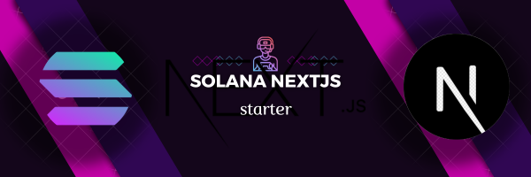

# Solana NextJS Starter



## Tech stack

- **[Next.js](https://nextjs.org/)**
- **[Tailwind CSS](https://tailwindcss.com/)**
- **[Radix UI](https://www.radix-ui.com/)**
- **[Solana Wallet Adapter](https://github.com/solana-labs/wallet-adapter)**
- **[@solana/web3.js Solana JavaScript SDK](https://solana-labs.github.io/solana-web3.js/)**
- **[Tailwind Variants](https://www.tailwind-variants.org/)**
- **[ESlint](https://eslint.org/)**
- **[Prettier](https://prettier.io/)**
- **[Storybook](https://storybook.js.org/)**
- **[Jest](https://jestjs.io/)**
- **[React Testing Library](https://testing-library.com/react)**
- **[Playwright](https://playwright.dev/)**
- **[Conventional commits](https://www.conventionalcommits.org/)**
- **[Renovate BOT](https://www.whitesourcesoftware.com/free-developer-tools/renovate)**
- **[Semantic Release](https://github.com/semantic-release/semantic-release)**

## 🎯 Getting Started

To get started with this boilerplate, follow these steps:

1. Clone repository:


2. Install the dependencies:

```bash
yarn install --frozen-lockfile
```

3. Run the development server:

```bash
yarn dev
```

4. Open [http://localhost:3000](http://localhost:3000) with your browser to see the result.

## 🚀 Deployment

One click deployment

[](https://vercel.com/new/git/external)

## 🤝 How to Contribute

I highly appreciate contributions from the community! If you'd like to contribute, please adhere to the following guidelines:

1. Fork the repository.
2. Create a new branch with a clear and descriptive name that reflects the nature of your changes.
3. Implement your modifications and commit them following the Conventional Commits format.
4. Push your changes to your forked repository.
5. Open a pull request, and I will carefully review your changes.

## 💕 Support

Drop this repo ⭐ star

## 📜 License

This project is licensed under the MIT License. For more information, see the [LICENSE](./LICENSE) file.